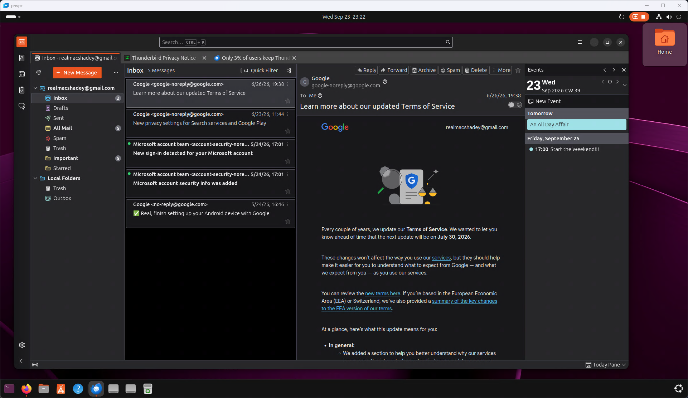
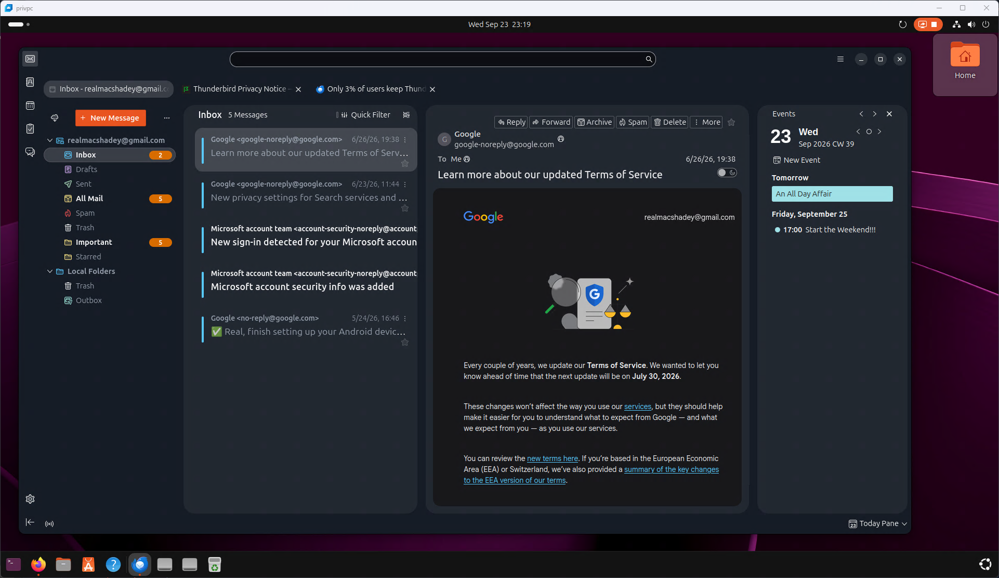
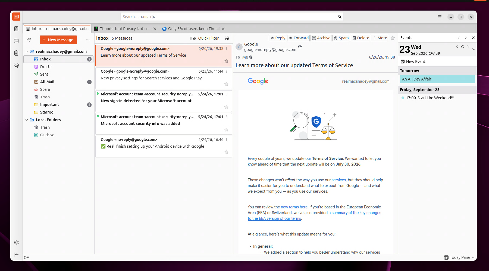
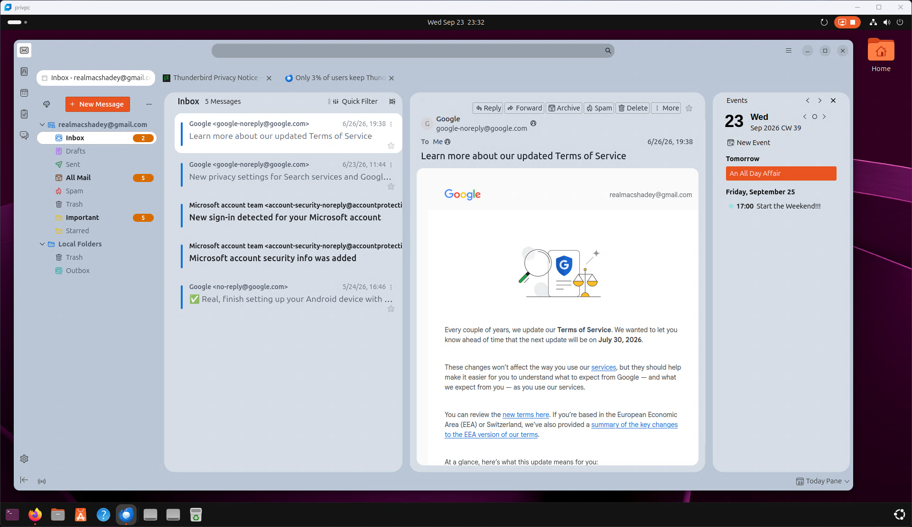

# Macshadey Thunderbird Theme

Stylesheets for the Macshadey Thunderbird theme.

## Screenshots







## Installation

These instructions work on Windows, macOS, and Linux.

### 1. Download the theme

1. On this GitHub page, click the green **Code** button.
2. Click **Download ZIP**.
3. Open the downloaded ZIP file and copy the two files inside it named:
   - `userChrome.css`
   - `userContent.css`

Keep these files somewhere easy to find for the next steps. Do not copy the ZIP file itself into Thunderbird.

### 2. Open your Thunderbird profile folder

1. Open Thunderbird.
2. Click the menu button (the **☰** button).
3. Choose **Help**, then **More Troubleshooting Information**.
4. Find **Profile Folder** and click **Open Folder** (Windows/Linux) or **Show in Finder** (macOS).

Leave the folder window open. This is the folder Thunderbird uses for your personal settings.

### 3. Add the theme files

1. In your Thunderbird profile folder, create a new folder named `chrome` if one does not already exist.
2. Open the `chrome` folder.
3. Copy `userChrome.css` and `userContent.css` into this folder.

The final location should look like this:

```text
Thunderbird profile folder/
└── chrome/
    ├── userChrome.css
    └── userContent.css
```

If files with these names already exist, make a backup copy before replacing them. Other Thunderbird customizations may use the same files.

### 4. Tell Thunderbird to load the theme

1. In Thunderbird, open the menu and choose **Settings**.
2. Scroll to the bottom and click **Config Editor**.
3. If Thunderbird shows a warning, click **Accept the Risk and Continue**.
4. Search for:

   ```text
   toolkit.legacyUserProfileCustomizations.stylesheets
   ```

5. If the setting is `false`, click the switch to change it to `true`.
6. Close the Config Editor and restart Thunderbird.

The Macshadey theme should now be active.

## Updating the theme

Download the newest version from GitHub and replace the two files in your profile's `chrome` folder. Restart Thunderbird afterward.

## Removing the theme

Close Thunderbird, then remove `userChrome.css` and `userContent.css` from the profile's `chrome` folder. You can also change `toolkit.legacyUserProfileCustomizations.stylesheets` back to `false`.

## If the theme does not appear

- Make sure the files are named exactly `userChrome.css` and `userContent.css` (not `userChrome.css.txt`).
- Make sure both files are directly inside the `chrome` folder, not inside another folder.
- Confirm that `toolkit.legacyUserProfileCustomizations.stylesheets` is set to `true`.
- Restart Thunderbird completely after making changes.
